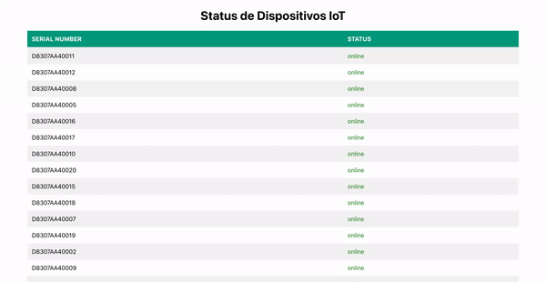

# Dashboard


# Sobre
Este é um projeto para desenvolver um servidor para dispositivos IoT, um simulador de dispositivo IoT e uma aplicação frontend para exibir os dispositivos online/offline.

## 🚀 Começando
Essas instruções permitirão que você obtenha uma cópia do projeto em operação na sua máquina local para fins de desenvolvimento e teste.

### 📋 Pré-requisitos
Node.js no Servidor e no Simulador de Dispositivo (versão 14.17.6)

### 🔧 Instalação
1. Clone este repositório para sua máquina local:
```
git clone https://github.com/DaywisonFerreira/iot-server-teste.git
```
2. Navegue até o diretório do projeto:
```
cd iot-server-teste
```
3. Navegue até o diretório do servidor:
```
cd server
```
4. Abra o terminal e execute os comandos abaixo para instalar as dependências e iniciar o servidor e simulador:
```
npm i
npm run all
```

5. Para iniciar o front end da aplicação navegue até a pasta client e execute os comandos:
```
cd ..
cd client
npm i
npm start
```

Isso iniciará o servidor backend o simulador e o frontend da aplicação.

O servidor backend estará acessível em http://localhost:4000 e o frontend em http://localhost:3000.

### Uso
### Servidor para Dispositivos IoT
O servidor possui as seguintes rotas:

```
POST /callback: Recebe uma requisição nesta rota, considerando o dispositivo como "online" e responde 'OK' após 33 segundos.
```

```
GET /status?serialNumber=xxx: Responde se o dispositivo está online/offline.
```
OBS: Se o dispositivo deixar de se comunicar, após 10 segundos é considerado como "offline".

### 📜 Documentação API
Você pode acessar a documentação da API através do Swagger em http://localhost:4000/api-docs/.

### Made with :heart: by Daywison Leal
-  [LinkedIn](https://www.linkedin.com/in/daywison-leal/)